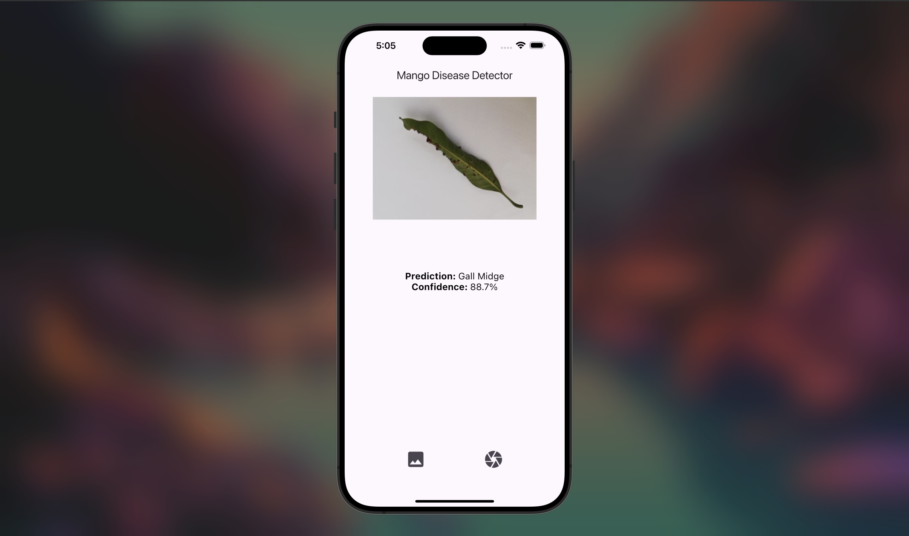
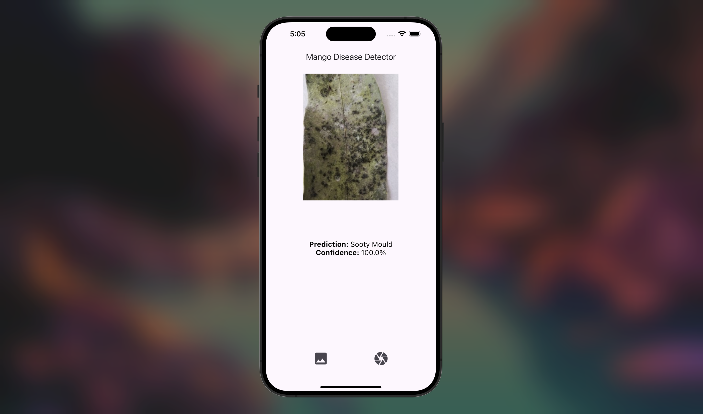
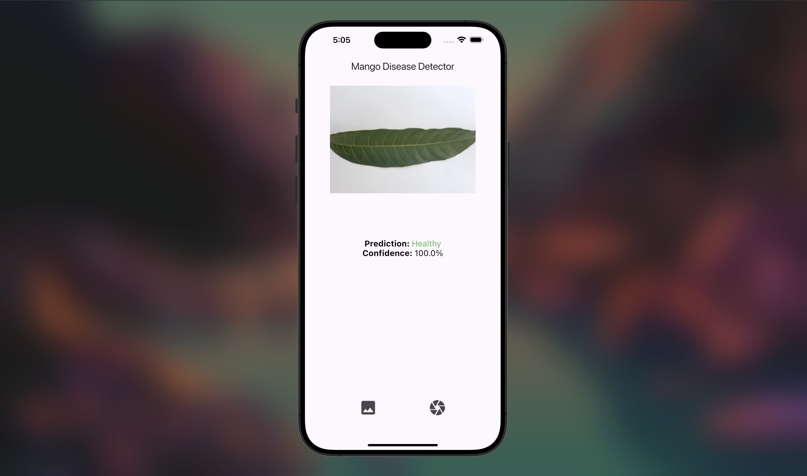

# mango_disease_detector
A Flutter application that uses TensorFlow Lite to detect diseases in mango leaves from images. The app allows users to capture or select leaf images and identifies potential diseases using a pre-trained machine learning model.

## Screenshots

